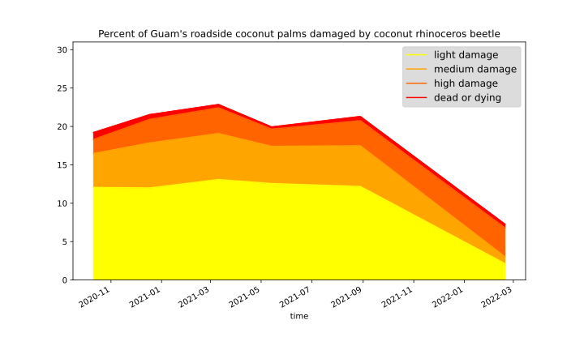

# Guam-CRB-Damage-Map-2021-08

This repository stores an [online interactive map of coconut rhinoceros damage on Guam](https://aubreymoore.github.io/Guam-CRB-Damage-Map-2021-08/webmap) created using data from automated analysis of roadside imagery surveys performed during August 2021. For a nontechnical overview of the survey method see the [WPTRC 2020 Impact Report](https://www.uog.edu/_resources/files/wptrc/2020WPTRCFinal.pdf), pages 7-10.

A **QGIS project** and **SpatiaLite database** for making the map are stored in **Guam05.qgz** and **Guam05.db**.

## Previous Guam CRB Damage Maps

[Oct 2020](https://aubreymoore.github.io/new-crb-damage-map/#11/13.4437/144.7861) 
[Dec 2020](https://aubreymoore.github.io/Guam-CRB-damage-map-2020-12/webmap/v1/#11/13.4437/144.7861) 
[March 2021](https://aubreymoore.github.io/Guam-CRB-Damage-Map-2021-03/#11/13.4437/144.7861) 
[May 2021](https://aubreymoore.github.io/Guam-CRB-Damage-Map-2021-05/webmap/#11/13.4437/144.7861) 

## Timeline Plot

